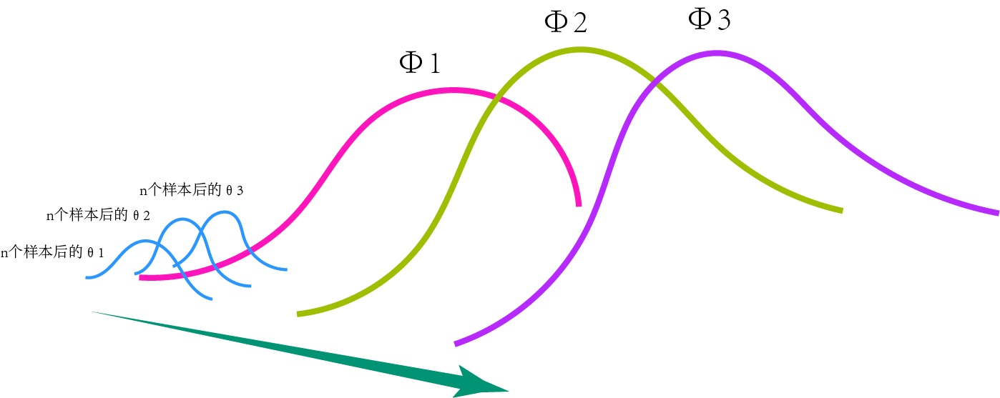
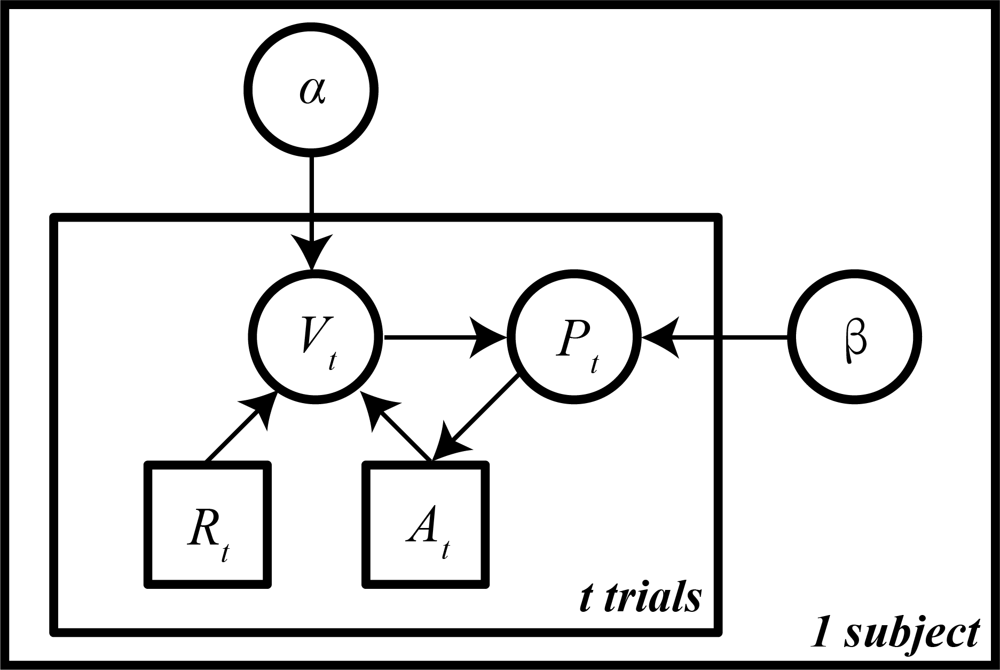
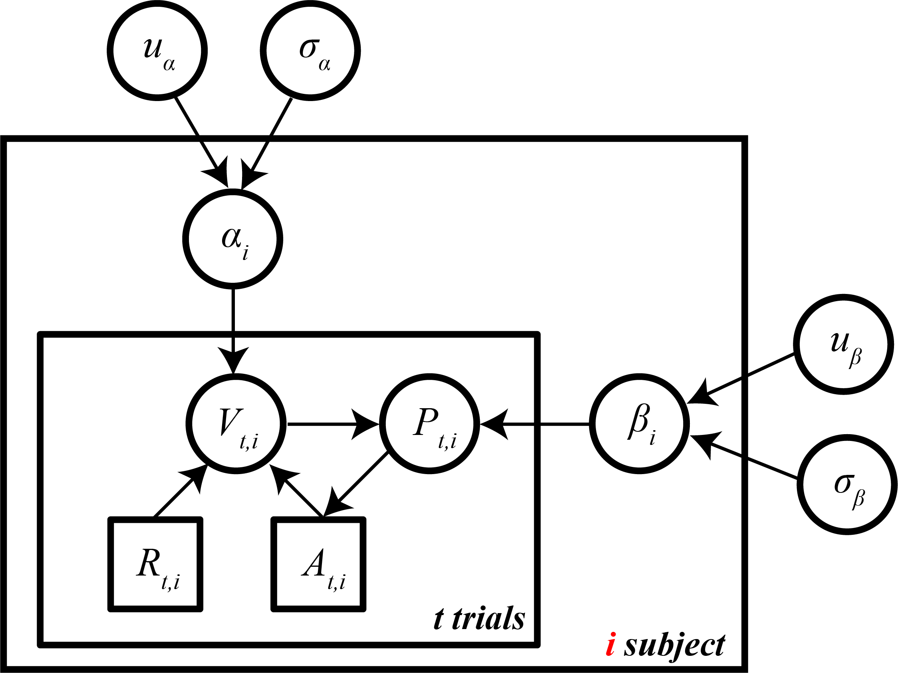

# P1~P2

### 1.频率主义置信区间和贝叶斯置信区间的区别

$$
随机变量\theta服从某一分布，\theta\sim Beta(\alpha,\beta),其概率分布函数为p(\theta),有p(\theta)=f(\theta)=Beta(\alpha,\beta)\\
样本\chi取自该分布Beta(\alpha,\beta)
$$

$$
频率主义的执行区间指的是随机抽样样本所产生的所有区间\\
(a,b)=(x_{mean}\pm\dfrac{1.96\sigma}{\sqrt{n}})\\
有百分之95包含真实的均值μ\\
贝叶斯置信区间指的就是区间内(a,b)有百分之95包含真实的均值μ
$$
### 2.公式

$$
p(u)=\int p(u,v)dv = \int p(u\vert v)p(v)dv
$$

$$
\vec u = (u_1,u_2,\cdots,u_k)^T\\
p(\vec u)=p(u_1)p(u_2\vert u_1)p(u_3\vert u_1,u_2)\cdots p(u_k\vert u_1,\cdots,u_{k-1})\\
=p(u_1\vert u_2,\cdots,u_{k})p(u_2\vert u_3,\cdots,u_k)\cdots p(u_{k-1}\vert u_k)p(u_k)
$$

$$
E(u)=\iint up(u,v)dudv=\int u\int p(u,v)dvdu=\int up(u)du\\
E(u)=\iint up(u,v)dudv=\iint up(u\vert v)dup(v)dv=\\\int E(u\vert v)p(v)dv=E(E(u\vert v))
$$

$$
D(X)=E(X^2)-E(X)^2=E((X-E(X))^2)\\=\int(u-E(u))^2p(u)du\\
D(u)=E(D(u\vert v))+D(E(u\vert v))
$$

#### 协方差矩阵

$$
D(\vec u)=\int (\vec u-E(\vec u))(\vec u-E(\vec u))^Tp(u)du
$$

#### 转换

$$
suppose\quad two\quad discrete\quad distributions\quad\vec v,\vec u:\vec v=f(\vec u)=a\vec u+b\\
p_{\vec v}(\vec v)=p_{\vec u}(\vec u):表示\vec v在其对应的概率分布函数上的概率等于\vec u在其对应的概率分布函数上的概率.
$$

$$
suppose\quad two\quad continuous\quad distributions\quad\vec v,\vec u:\vec v=f(\vec u)=a\vec u+b\\
p_{\vec v}(\vec v,\vec v+d\vec v)=p_{\vec u}(\vec u,\vec u+d\vec u)\rightarrow p_{\vec v}(\vec v)\times d\vec v=p_{\vec u}(\vec u)\times d\vec u\rightarrow p_{\vec v}(\vec v)=p_{\vec u}(\vec u)\times \vert {\dfrac {d\vec u}{d\vec v}}\\
\vert {\dfrac {d\vec u}{d\vec v}}\vert\dot {=}\vert {\dfrac {\partial u_i}{\partial v_j}}\vert=\left \vert {\begin{matrix}\dfrac {\partial u_1}{\partial v_1}&\dfrac {\partial u_1}{\partial v_2}&\dfrac {\partial u_1}{\partial v_3}&\cdots&\dfrac {\partial u_1}{\partial v_n}\\\dfrac {\partial u_2}{\partial v_1}&\dfrac {\partial u_2}{\partial v_2}&\dfrac {\partial u_2}{\partial v_3}&\cdots&\dfrac {\partial u_2}{\partial v_n}\\\vdots&\vdots&\vdots&\ddots&\vdots\\\dfrac {\partial u_n}{\partial v_1}&\dfrac {\partial u_n}{\partial v_2}&\dfrac {\partial u_n}{\partial v_3}&\cdots&\dfrac {\partial u_n}{\partial v_n}\end{matrix}}\right \vert
$$

$$
if\quad\vec \theta=(\theta_1,\theta_2,\cdots,\theta_k)\\
the\quad marginal \quad distribution\quad p(\theta_i\vert y)=\int p(\vec \theta \vert y)d\theta_1d\theta_2d\theta_3\cdots d\theta_{i-1}d\theta_{i+1}\cdots d\theta_{k-1}d\theta_{k}\\
使用采样方法求出边缘概率分布函数:我们关注k个参数中的其中一个\theta_i,进行多次采样有样本\chi = (\vec \theta^1,\vec \theta^2,\vec \theta^3,\cdots,\vec \theta^L),则行向量\\(\theta^1_i,\theta^2_i,\theta^3_i,\cdots,\theta^L_i)\\取自边缘概率分布函数p(\theta_i \vert y)所形成的分布,有\\
E(\theta_i \vert y)=\dfrac {1}{L}\sum\limits_{k=1}^{L}\theta_i^k=\int \theta_ip(\theta_i\vert y)d\theta_i\\
其百分之95置信区间就是(\hat{a},\hat{b})=(2.5\%\theta_i分位点,97.5\%\theta_i分位点)\\
我们关心\psi=g(\theta_i),则E(\psi \vert y)=\dfrac {1}{L}\sum\limits_{k=1}^{L}g(\theta_i^k)=\int \psi p_\theta(\theta_i\vert y)d\psi
$$

# P3

$$
观察到的数据集y取自p(y \vert \theta)形成的分布\\
推断p(\theta \vert y),有p(\theta \vert y)=\dfrac {p(y\vert \theta)p(\theta)}{p(y)}:\\\theta在确定的y上的概率分布函数正比于y在不同\theta上形成的概率分布函数与其先验概率分布函数的乘积\\
\theta是变量,y是定量
$$

### 贝叶斯渐进学习

$$
观察到的数据集y取自p(y \vert \theta)形成的分布\\y_1,y_2,\cdots,y_n\vert\theta\\
new\quad data\quad y_{i+1}:\quad p(\theta\vert y_{i+1},y)=\dfrac {p(y_{i+1} \vert\theta)p(\theta\vert y)}{p(y_{i+1}\vert y)}\\
当i=0时:p(\theta\vert y_1)=\dfrac {p(y_1\vert \theta)p(\theta)}{p(y_1)}\\
当i=1时: p(\theta\vert y_{2},y)=\dfrac {p(y_{2} \vert\theta)p(\theta\vert y_1)}{p(y_{2}\vert y_1)}\\
当i=2时: p(\theta\vert y_{3},y)=\dfrac {p(y_{3} \vert\theta)p(\theta\vert y_1,y_2)}{p(y_{3}\vert y_1,y_2)}\\
\vdots\\
每一部都形成一个新的概率分布函数p(\theta\vert y_{i+1},y),使得其成为下一个的先验概率分布函数，最后得到p(\theta\vert y)的概率分布函数
$$

### 二项分布参数估计

$$
对于一个二项分布x\sim b(n,\theta),Pr(x)=C^{x}_{n}\theta^x(1-\theta)^{n-x}\\
\theta位于0\sim 1之间，可以假设\theta\sim N(0.5,\sigma^2),或者\theta\sim U(0,1)\\y_1,y_2,\cdots,y_n\vert\theta\sim i.i.d.Ber(0,1):服从伯努利分布\\
\hat{y} =\sum\limits_{i=1}^{n}y_i\\
\hat{y}\sim b(n,\theta),\quad p(\hat{y}\vert\theta)=C^{\hat{y}}_{n}\theta^{\hat{y}}(1-\theta)^{n-\hat{y}}\\
当i=0,y_1 = 0:p(\theta\vert y_1)=\dfrac {p(y_1\vert \theta)p(\theta)}{p(y_1)}=\dfrac {\theta^{y_1}(1-\theta)^{1-y_1}\times1}{\int p(y_1,\theta)d\theta=\int(1-\theta)d\theta=0.5}=2(1-\theta)=Beta(1,2)\\
当i=1,y_2 = 0:p(\theta\vert y_2,y_1)=\dfrac {p(y_2\vert \theta)p(\theta\vert y_1)}{p(y_2\vert y_1 )}=\dfrac {\theta^{y_2}(1-\theta)^{1-y_2}\times2(1-\theta)}{\int p(y_2\vert\theta)p(\theta\vert y_1)d\theta=\int2(1-\theta)^2d\theta=\dfrac {2}{3}}=3(1-\theta)^2=Beta(1,3)\\
当i=2,y_3=0:p(\theta\vert y_3,y)=\dfrac {p(y_3\vert \theta)p(\theta\vert y)}{p(y_3\vert y)}=\dfrac {\theta^{y_3}(1-\theta)^{1-y_3}\times3(1-\theta)^2}{\int p(y_3\vert\theta)p(\theta\vert y)d\theta=\int3(1-\theta)^3d\theta=\dfrac {3}{4}}=4(1-\theta)^3=Beta(1,4)\\
\vdots\\
当i=k,y_{k+1}=1:p(\theta\vert y_{k+1},y)=\dfrac {p(y_{k+1}\vert \theta)p(\theta\vert y)}{p(y_{k+1}\vert y)}=\dfrac {\theta^{y_{k+1}}(1-\theta)^{1-y_{k+1}}\times(k+1)(1-\theta)^k}{\int p(y_{k+1}\vert\theta)p(\theta\vert y)d\theta=\int\theta (k+1)(1-\theta)^kd\theta=\dfrac {1}{k+2}}\\=(k+1)(k+2)\theta(1-\theta)^k=Beta(2,k+1)\\
\vdots\\
其结果均为beta分布，\theta\vert y\sim Be(\hat{y}+1,n-\hat{y}+1)\\
*虽然每一个试次y_1,y_2,\cdots,y_n都是独立的，但是p(y_{i+1}\vert y)\neq p(y_{i+1})因为之前的试次会对之后的试次产生预测信息。\\
$$

### 拉普拉斯接续法则

$$
给定参数y=(y_1,y_2,\cdots,y_i),预测下一次试次y_{i+1}出现y_{i+1}=1的概率p(y_{i+1}=1\vert y,\theta)\\
p(y_{i+1}=1\vert y,\theta)=p(y_{i+1}=1\vert\theta)=\theta\\
\begin{aligned}
p(y_{i+1}\vert y)&=\int p(y_{i+1}=1,\theta\vert y)d\theta\\
&=\int p(y_{i+1}=1\vert\theta,y)p(\theta\vert y)d\theta\\
&=\int\theta p(\theta\vert y)d\theta\\
&=E(\theta\vert y)\\
&=E(Beta(\hat y+1,n-\hat y +1))\\
&=\dfrac {\hat y+1}{\hat y+1+n-\hat y+1}=\dfrac {\hat y+1}{n+2}
\end{aligned}\\
在一个未知比例的红白纸条箱里抽取纸条，则下一张抽取纸条是红色的概率为\dfrac {\hat y_{红色}+1}{n_{总共}+2}
$$

### 共轭性

$$
suppose\quad \theta\nsim U(0,1)\sim Beta(\alpha,\beta)\\
\begin{aligned}
p(\theta\vert y)&\propto\theta^{\alpha-1}(1-\theta)^{\beta-1}\theta^{\hat y}(1-\theta)^{n-\hat y}\\
&\propto\theta^{\alpha-1+\hat y}(1-\theta)^{\beta-1+n-\hat y}\\
&\propto Beta(\alpha+\hat y,\beta+n-\hat y)
\end{aligned}\\
共轭性:后验分布和先验分布的参数模型相同\quad*共轭性与总体分布y\sim p(y\vert\theta)密切相关\\
先验模型的参数为超参数:hyperparameters
$$

#### 		习题

$$
\theta\sim Bata(\alpha,\beta)\\
\begin{aligned}
p(y)&=\int p(y,\theta)d\theta\\
&=\int p(y\vert\theta)p(\theta)d\theta\\
&=\int C^{\hat y_n}\theta^{\hat y}(1-\theta)^{n-\hat y}\dfrac {\theta^{\alpha-1}(1-\theta)^{\beta-1}}{\int u^{\alpha-1}(1-u)^{\beta-1}du}d\theta\\
&=C^{\hat y_n}\int \dfrac {\theta^{\alpha-1+\hat y}(1-\theta)^{\beta-1+n-\hat y}}{\int u^{\alpha-1}(1-u)^{\beta-1}du}d\theta\\
&=\dfrac{n!}{\hat y!(n-\hat y)!}\dfrac{1}{\dfrac{(\alpha-1)!(\beta-1)!}{(\alpha+\beta-1)!}}\dfrac{(\alpha+\hat y-1)!(\beta+n-\hat y-1)!}{(\alpha+\beta+n-1)!}
\end{aligned}
$$

# P4

### MAP

$$
MAP(maximum\quad a\quad posteriror:最大后验估计),取估计的\hat \theta为众数\\
由y=(y_1,y_2,\cdots,y_n),\theta\sim Beta(\alpha,\beta),有\theta\vert y\sim Beta(\alpha+\hat y,\beta+n-\hat y)\\
则\hat \theta_{MAP}=\dfrac {\alpha+\hat y-1}{\alpha+\beta+n-2}\\
\hat \theta_{MAP}:\dfrac {\partial log[p(\theta\vert y)]}{\partial \theta}=0\\
if\quad \theta\sim U(0,1)\sim Beta(1,1),\theta\vert y\sim Beta(1+\hat y,1+n-\hat y)\\
\hat \theta_{MAP}=\dfrac{1+\hat y-1}{1+\hat y+1+n-\hat y-2}=\dfrac {\hat y}{n}(MLE)
$$

### 混合先验

$$
假设有先验知识\theta\sim Beta(\alpha,\beta),但是不确定在n次中正面的数量是\hat y还是n-\hat y\\
p(\theta)=Beta(\hat y+1,n-\hat y+1);or\quad p(\theta)=Beta(n-\hat y+1,\hat y+1)\\
\begin{aligned}
p(\theta)&=p(\theta\vert \alpha=\hat y +1)p(\alpha=\hat y +1)+p(\theta\vert \alpha=n-\hat y+1)p(\alpha=n-\hat y+1)\\&=0.5\times p(\theta\vert \alpha=\hat y +1)+0.5\times p(\theta\vert \alpha=n-\hat y+1)
\end{aligned}
$$

### 混合先验的学习

$$
\\
\begin{aligned}
p(\theta)&=p_1p(\theta\vert Conditon=1)+p_2p(\theta\vert Condition=2)\\
&=p_1Beta(\alpha_1,\beta_1)+p_2Beta(\alpha_2,\beta_2)
\end{aligned}\\
\begin{aligned}
p(\theta\vert y)&\propto\theta^{\hat y}(1-\theta)^{n-\hat y}\Bigg[p_1Beta(\alpha_1,\beta_1)+p_2Beta(\alpha_2,\beta_2)\Bigg]\\
&=\theta^{\hat y}(1-\theta)^{n-\hat y}\Bigg[p_1\dfrac {\theta^{\alpha_1-1}(1-\theta)^{\beta_1-1}}{\int u^{\alpha_1-1}(1-u)^{\beta_1-1}du}d\theta+p_2\dfrac {\theta^{\alpha_2-1}(1-\theta)^{\beta_2-1}}{\int u^{\alpha_2-1}(1-u)^{\beta_2-1}du}d\theta\Bigg]\\
&=\theta^{\hat y}(1-\theta)^{n-\hat y}\Bigg[p_1\dfrac {\Gamma(\alpha_1+\beta_1)}{\Gamma(\alpha_1)\Gamma(\beta_1)}\theta^{\alpha_1-1}(1-\theta)^{\beta_1-1}+p_2\dfrac {\Gamma(\alpha_2+\beta_2)}{\Gamma(\alpha_2)\Gamma(\beta_2)}\theta^{\alpha_2-1}(1-\theta)^{\beta_2-1}\Bigg]\\
&=\Bigg[p_1\dfrac {\Gamma(\alpha_1+\beta_1)}{\Gamma(\alpha_1)\Gamma(\beta_1)}\theta^{\alpha_1-1+\hat y}(1-\theta)^{\beta_1-1+n-\hat y}+p_2\dfrac {\Gamma(\alpha_2+\beta_2)}{\Gamma(\alpha_2)\Gamma(\beta_2)}\theta^{\alpha_2-1+\hat y}(1-\theta)^{\beta_2-1+n-\hat y}\Bigg]\\
\\
&\quad\quad\quad\quad\quad令\begin{aligned}
\rho_1&=p_1\dfrac {\Gamma(\alpha_1+\beta_1)}{\Gamma(\alpha_1)\Gamma(\beta_1)}\dfrac {\Gamma(\alpha_1+\hat y)\Gamma(\beta_1+n-\hat y)}{\Gamma(\alpha_1+\beta_1+n)}\\
\rho_2&=p_2\dfrac {\Gamma(\alpha_2+\beta_2)}{\Gamma(\alpha_2)\Gamma(\beta_2)}\dfrac {\Gamma(\alpha_2+\hat y)\Gamma(\beta_2+n-\hat y)}{\Gamma(\alpha_2+\beta_2+n)}
\end{aligned}\\
\\
&\propto\dfrac{p_1\dfrac {\Gamma(\alpha_1+\beta_1)}{\Gamma(\alpha_1)\Gamma(\beta_1)}\dfrac {\Gamma(\alpha_1+\hat y)\Gamma(\beta_1+n-\hat y)}{\Gamma(\alpha_1+\beta_1+n)}\times \dfrac{\Gamma(\alpha_1+\beta_1+n)}{\Gamma(\alpha_1+\hat y)\Gamma(\beta_1+n-\hat y)}\theta^{\alpha_1-1+\hat y}(1-\theta)^{\beta_1-1+n-\hat y}}{p_1\dfrac {\Gamma(\alpha_1+\beta_1)}{\Gamma(\alpha_1)\Gamma(\beta_1)}\dfrac {\Gamma(\alpha_1+\hat y)\Gamma(\beta_1+n-\hat y)}{\Gamma(\alpha_1+\beta_1+n)}+p_2\dfrac {\Gamma(\alpha_2+\beta_2)}{\Gamma(\alpha_2)\Gamma(\beta_2)}\dfrac {\Gamma(\alpha_2+\hat y)\Gamma(\beta_2+n-\hat y)}{\Gamma(\alpha_2+\beta_2+n)}}\\
&+\dfrac{p_2\dfrac {\Gamma(\alpha_2+\beta_2)}{\Gamma(\alpha_2)\Gamma(\beta_2)}\dfrac {\Gamma(\alpha_2+\hat y)\Gamma(\beta_2+n-\hat y)}{\Gamma(\alpha_2+\beta_2+n)}\times \dfrac{\Gamma(\alpha_2+\beta_2+n)}{\Gamma(\alpha_2+\hat y)\Gamma(\beta_2+n-\hat y)}\theta^{\alpha_2-1+\hat y}(1-\theta)^{\beta_2-1+n-\hat y}}{p_1\dfrac {\Gamma(\alpha_1+\beta_1)}{\Gamma(\alpha_1)\Gamma(\beta_1)}\dfrac {\Gamma(\alpha_1+\hat y)\Gamma(\beta_1+n-\hat y)}{\Gamma(\alpha_1+\beta_1+n)}+p_2\dfrac {\Gamma(\alpha_2+\beta_2)}{\Gamma(\alpha_2)\Gamma(\beta_2)}\dfrac {\Gamma(\alpha_2+\hat y)\Gamma(\beta_2+n-\hat y)}{\Gamma(\alpha_2+\beta_2+n)}}\\
\\
&=\dfrac{\rho_1}{\rho_1+\rho_2}Beta(\alpha_1+\hat y,\beta_1+n-\hat y)+\dfrac{\rho_2}{\rho_1+\rho_2}Beta(\alpha_2+\hat y,\beta_2+n-\hat y)
\end{aligned}\\
因为\dfrac{\rho_1}{\rho_1+\rho_2}+\dfrac{\rho_2}{\rho_1+\rho_2}=1，所以\\
p(\theta\vert y)=\dfrac{\rho_1}{\rho_1+\rho_2}Beta(\alpha_1+\hat y,\beta_1+n-\hat y)+\dfrac{\rho_2}{\rho_1+\rho_2}Beta(\alpha_2+\hat y,\beta_2+n-\hat y)\\
\\
\\
suppose\quad p_1=p_2=0.5;\alpha_1=\beta_2;\alpha_2=\beta_1\\
\dfrac{\rho_2}{\rho_1+\rho_2}=\Big[\dfrac{\rho_1}{\rho_2}+1\Big]^{-1}\\
\dfrac{\rho_1}{\rho_2}=\dfrac {\Gamma(\alpha_1+\hat y)\Gamma(\beta_1+n-\hat y)}{\Gamma(\alpha_2+\hat y)\Gamma(\beta_2+n-\hat y)}\\
则p(\theta\vert y)= \Bigg(1-\Big[\dfrac{\rho_1}{\rho_2}+1\Big]^{-1}\Bigg)Beta(\alpha_1+\hat y,\beta_1+n-\hat y)+\Bigg(\Big[\dfrac{\rho_1}{\rho_2}+1\Big]^{-1}\Bigg)Beta(\alpha_2+\hat y,\beta_2+n-\hat y)
$$

### 指数改写

$$
二项分布可改写为指数族分布\\
\begin{aligned}
p(y\vert\theta)&\propto \theta^{\hat y}(1-\theta)^{n-\hat y}\\
&=(1-\theta)^ne^{\hat yIn{\dfrac {\theta}{1-\theta}}}\\
&=e^{\Bigg(\hat yIn\dfrac{\theta}{1-\theta}+In(1-\theta)^n\Bigg)}
\end{aligned}\\
当n=1时，就为伯努利分布\\
In\dfrac{\theta}{1-\theta}为指数族分布的天然参数，令\phi=In\dfrac{\theta}{1-\theta}=logit(\theta),则\theta=\dfrac{e^\phi}{1+e^\phi},有:\\
\begin{aligned}
p(y\vert\phi)&\propto e^{\Bigg(\hat y\phi-In(1+e^\phi)^n\Bigg)}\\&=\dfrac{e^{\hat y\phi}}{(1+e^\phi)^n}\\
\end{aligned}\\
则p(\phi\vert y)\propto\dfrac{e^{\hat y\phi}}{(1+e^\phi)^n}\times p(\phi),当\phi服从指数族分布时,是共轭的\\
现在要求,在给定\phi的先验分布p(\phi)下,求\theta的先验分布p(\theta):p_\theta(\theta)=p_\phi(\phi)\vert{\dfrac{d\phi}{d\theta}}\\
若\phi\sim N(\mu,\sigma^2)=\dfrac{1}{\sqrt{2\pi}\sigma}e^{-\dfrac{(\phi-\mu)^2}{2\sigma^2}},则p(\theta)=\dfrac{1}{\sqrt{2\pi}\sigma}e^{-\dfrac{\bigg(In\dfrac{\theta}{1-\theta}-\mu\bigg)^2}{2\sigma^2}}\times\dfrac{1}{\theta(1-\theta)}\\
\\
\\
当n=1时，p(y\vert\phi)=\dfrac{e^{\hat y\phi}}{(1+e^\phi)}=\dfrac{1}{e^{-\phi\hat y}+e^{\phi(1-\hat y)}}\\
softmax=\frac{1}{1+e^{-\beta(V_1-V_2)}},若V_1-V_2>0,softmax>0.5,选择V1\\
设\hat y=\begin{aligned}
&1,如果V_1-V_2>0,选择一选项\\
\\
&0,如果V_1-V_2<0,选择二选项
\end{aligned}\\
则p(选择一选项\vert \phi)=\begin{aligned}
&\dfrac{1}{e^{-\phi}+1},如果V_1-V_2>0
\\
&1-\dfrac{1}{1+e^{\phi}}=\dfrac{e^\phi}{1+e^\phi}=\dfrac{1}{e^{-\phi}+1},如果V_1-V_2<0
\end{aligned}
$$

# P5

### 最高后验密度区（HPDR）

$$
设A是一个HPDR,其满足:
\begin{aligned}
&Pr(\theta\in A\vert y)=0.95;区间的总面积是0.95
\\
\\
&\forall \theta_1\in A和\forall \theta_1\notin A,一定有p(\theta_1\vert y)\geq p(\theta_2\vert y):所有在区间内的\theta的p.d.大于不在区间内的\theta的p.d.
\end{aligned}\\
能够较好地描述多峰分布和偏分布的信息
$$

### 双独立参数

$$
y_1\sim Bin(n_1,\theta_1)\\
y_2\sim Bin(n_2,\theta_2)\\
\theta_1,\theta_2先验独立，则他么后验独立:\\
\begin{aligned}
p(\theta_1,\theta_2\vert y_1,y_2)&\propto p(y_1,y_2\vert \theta_1,\theta_2)p(\theta_1,\theta_2)\\
&=p(y_1\vert \theta_1)p(y_2\vert \theta_2)p(\theta_1)p(\theta_2)\\
&\propto p(\theta_1\vert y_1)p(\theta_2\vert y_2)
\end{aligned}\\
$$

### 检验

$$
y_1\sim Bin(n_1,\theta_1)\\
y_2\sim Bin(n_2,\theta_2)\\
关注\theta_1是否大于或小于\theta_2,则关注随机变量\phi=\theta_1-\theta_2\\
*p(\phi\vert y_1,y_2)的表达式是两个随机变量\theta_1,\theta_2的卷积:v=-\theta_2,p_v(v\vert y_2)=p_{\theta_2}(\theta_2\vert y_2)\vert{\dfrac{d\theta_2}{dv}}\\\int p(t\vert y_1)p_v(\phi -t\vert y_2)dt\\

设样本\Bigg{\lbrace}\begin{aligned}&
y_1=(y_1^1,y_1^2,y_1^2,\cdots,y_1^j)\\
&y_2=(y_2^1,y_2^2,y_2^2,\cdots,y_2^k)\\
\end{aligned}\\
$$

#### 		ECMO

$$
两种治疗方法:\\
\begin{aligned}
&ECMO:n_1(病人数)=9,y_1(存活数)=9\\
&CMT:n_1(病人数)=10,y_1(存活数)=6
\end{aligned}\\
p(\theta_1,\theta_2\vert y_1,y_2):
\theta_1\vert y_1\sim Beta(10,1);\quad\theta_2\vert y_2\sim Beta(7,5)\\
要求Pr(\theta_1>\theta_2\vert y_1,y_2),即求\int\limits_{\phi>0}p(\phi\vert y_1,y_2)d\phi\\
\begin{aligned}
p(\phi\vert y_1,y_2)&=\int Beta(t;10,1)Beta(-[\phi-t];7,5)dt\\
&=\int\dfrac{\Gamma(10+1)}{\Gamma(10)\Gamma(1)}t^9(1-t)^0\times\dfrac{\Gamma(7+5)}{\Gamma(7)\Gamma(5)}(t-\phi)^6(1+\phi-t)^4dt\\
&=23100\int_0^1 t^9(t-\phi)^6(1+\phi-t)^4dt
\end{aligned}
$$

### 非独立参数

$$
当\theta_1和\theta_2不独立,则它们组成联合先验分布p(\theta_1,\theta_2)，其后验分布也是联合分布:p(\theta_1,\theta_2\vert y_1,y_2)\\
$$

#### 				多元正态分布

$$
\\
\begin{aligned}
&一维的:p(x)=\dfrac{1}{\sqrt{2\pi}\sigma}e^{-\dfrac{(x-\mu)^2}{2\sigma^2}}=\dfrac{1}{\sqrt{2\pi}}\dfrac{1}{\sqrt{\sigma^2}}e^{\Bigg[-\dfrac{1}{2}(x-\mu)(\sigma^2)^{-1}(x-\mu)\Bigg]}\\
&二维的:p(x_1,x_2)=\dfrac{1}{2\pi\sigma_1\sigma_2\sqrt{1-\rho^2}}e^{\Bigg\lbrace-\dfrac{1}{2(1-\rho^2)}\Bigg[\Bigg(\dfrac{x_1-\mu_1}{\sigma_1}\Bigg)^2-2\rho\Bigg(\dfrac{x_1-\mu_1}{\sigma_1}\Bigg)\Bigg(\dfrac{x_2-\mu_2}{\sigma_2}\Bigg)+\Bigg(\dfrac{x_2-\mu_2}{\sigma_2}\Bigg)^2\Bigg]\Bigg\rbrace}\\
&多维的:令X=(x_1,x_2,\cdots,x_n),\vec\mu=(\mu_1,\mu_2,\cdots,\mu_n),\sum=\left[\begin{matrix}
\sigma_1^2&\sigma_1\sigma_2\rho_{12}&\sigma_1\sigma_3\rho_{13}&\cdots&\sigma_1\sigma_n\rho_{1n}\\
\sigma_2\sigma_1\rho_{21}&\sigma_2^2&\sigma_2\sigma_3\rho_{23}&\cdots&\sigma_2\sigma_n\rho_{2n}\\
\sigma_3\sigma_1\rho_{31}&\sigma_3\sigma_2\rho_{32}&\sigma_3^2&\cdots&\sigma_3\sigma_n\rho_{2n}\\
\vdots&\vdots&\vdots&\ddots&\vdots\\
\sigma_n\sigma_1\rho_{n1}&\sigma_n\sigma_2\rho_{n2}&\sigma_n\sigma_3\rho_{n3}&\cdots&\sigma_n^2\\
\end{matrix}
\right]\\
&有p(X)=\dfrac{1}{(2\pi)^{\dfrac{n}{2}}\vert{\sum}^{\dfrac{1}{2}}}e^{\Bigg[-\dfrac{1}{2}(X-\vec\mu)^T\sum^{-1}(X-\vec\mu)\Bigg]},记作X\sim N_{n}(\vec \mu,\sum)
\end{aligned}\\
其中(X-\vec\mu)^T{\sum}^{-1}(X-\vec\mu)是由n个变量表示的一个值，为马氏距离:\\
\begin{aligned}
&1.当其为一元正态分布时,(x-\mu)(\sigma^2)^{-1}(x-\mu)表示点x到均值以标准差为单位的标准化距离d_\sigma的平方d_{\sigma}^2\\
&2.当其为多元正态分布时,(X-\vec\mu)^T{\sum}^{-1}(X-\vec\mu)表示点X_i=(x_1^i,x_2^i,\cdots,x_n^i)到中心点\mu=(\mu_1,\mu_2,\cdots,\mu_n)\\&的正交旋转过后的各个维度的标准化距离平方和d_{\sum}^2:\\
\end{aligned}\\
设X^\prime为旋转过后的点:(X-\vec\mu)^T{\sum}^{-1}(X-\vec\mu)=(X-\vec\mu)^T(Q^T)^{-1}{\Lambda}^{-1}Q^{-1}(X-\vec\mu)\\
\begin{aligned}
&=\big[Q^T(X-\vec\mu)\big]^T\Lambda^{-1}\big[Q^T(X-\vec\mu)\big]\\
&=\Bigg[\bigg(\dfrac{(x_1^\prime-\mu_1^\prime)^2}{\lambda_{1}^{2}}\bigg)+\bigg(\dfrac{(x_2^\prime-\mu_2^\prime)^2}{\lambda_{2}^{2}}\bigg)+\cdots+\bigg(\dfrac{(x_n^\prime-\mu_n^\prime)^2}{\lambda_{n}^{2}}\bigg)\Bigg]\\
\end{aligned}\\
特别的,当\rho_{ij}=0,有\sum=\Lambda;Q=I,则(X-\vec\mu)^T{\sum}^{-1}(X-\vec\mu)=\big[I(X-\vec\mu)\big]^T\Lambda^{-1}\big[I(X-\vec\mu)\big]\\
=\Bigg[\bigg(\dfrac{(x_1-\mu_1)^2}{\sigma_{1}^{2}}\bigg)+\bigg(\dfrac{(x_2-\mu_2)^2}{\sigma_{2}^{2}}\bigg)+\cdots+\bigg(\dfrac{(x_n-\mu_n)^2}{\sigma_{n}^{2}}\bigg)\Bigg]
$$

$$
设相关的联合先验分布p(\theta_1,\theta_2)\\
令\phi_i=logit(\theta_i)=In\dfrac {\theta_i}{1-\theta_i},i=1,2,且\\
\left[
\begin{aligned}
\phi_1\\
\phi_2
\end{aligned}
\right]\sim N\Bigg[\Big(\begin{aligned}
0\\
0\\
\end{aligned}\Big),\sigma^2\Big(\begin{matrix}
1&\rho\\
\rho&1
\end{matrix}\Big)\Bigg]\\
调整参数\sigma和\rho,从中取样观察点(\theta_1,\theta_2)的分布
$$

# P6

### 正态均值参数估计

$$
model:\\
\begin{aligned}
y\vert\theta&\sim N(\theta,\sigma^2);\sigma已知\\
\theta&\sim N(\mu_0,\tau_0^2);\mu_0,\tau_0^2固定参数
\end{aligned}\\
则后验概率:\\
\begin{aligned}
p(\theta\vert y)&\propto p(\theta)p(y\vert\theta)\\
&\propto e^{\Bigg\lbrace-\dfrac{(\theta-\mu_0)^2}{2\tau_0^2}\Bigg\rbrace}e^{\Bigg\lbrace-\dfrac{(y-\theta)^2}{2\sigma^2}\Bigg\rbrace}\\
&\propto e^{-\dfrac{1}{2}\Bigg[\dfrac{(\theta-\mu_0)^2}{\tau_0^2}+\dfrac{(y-\theta)^2}{\sigma^2}\Bigg]}\\
&\propto\underbrace{e^{\Bigg\lbrace-\dfrac{1}{\tau_1^2}\dfrac{(\theta-\mu_1)^2}{2}\Bigg\rbrace}}_{后验分布的核}\\
\\
&其中,\Bigg\langle\begin{aligned}&{\tau_1^2}=\dfrac{1}{\dfrac{1}{\tau_0^2}+\dfrac{1}{\sigma^2}}\longrightarrow \tau_n^2=\dfrac{\sigma^2\tau_0^2}{n\tau_0^2+\sigma^2}=\dfrac{\dfrac{\sigma^2\tau^2_0}{n}}{\tau^2_0+\dfrac{\sigma^2}{n}},当n很大时,\tau_n^2\approx\dfrac{\sigma^2}{n}\\
\\
&\mu_1=\dfrac{\dfrac{\mu_0}{\tau_0^2}+\dfrac{y}{\sigma^2}}{\dfrac{1}{\tau_0^2}+\dfrac{1}{\sigma^2}}\longrightarrow\Bigg\langle\begin{aligned}&每一次输入都是先验的加权平均\\
&设\hat y为输入(y_1,y_2,\cdots,y_n)的均值,则\mu_n=\dfrac{\dfrac{1}{\tau_0^2}}{\dfrac{n}{\sigma^2}+\dfrac{1}{\tau_0^2}}\mu_0+\dfrac{\dfrac{n}{\sigma^2}}{\dfrac{n}{\sigma^2}+\dfrac{1}{\tau_0^2}}\hat y
\end{aligned}\\
\end{aligned}\\
\end{aligned}\\
因此，p(\theta\vert y)\sim N(\mu_n,\tau_n^2):正态分布的均值\theta的共轭先验分布为正态分布
$$

$$
未来观测值的概率分布p(y\prime\vert y):\\
p(y\prime\vert y)=\int p(y\prime\vert\theta)p(\theta\vert y)d\theta\\
已知p(y\prime\vert\theta)=N(\theta,\sigma^2);\\
p(\theta\vert y)=N(\mu,\tau^2)\\
考虑p(y\prime,\theta\vert y),有联合随机变量(y\prime,\theta\vert y)\sim Normal\\
则p(y\prime\vert y)=\int p(y\prime\vert\theta)p(\theta\vert y)d\theta=\int p(y\prime,\theta\vert y)d\theta=p_{y\prime}(y\prime,\theta\vert y)=y\prime的边缘概率密度\\
由此,p(y\prime\vert y)=Normal\\
\\
Y_n=(y_1,\cdots,y_n)\\
E(y\prime\vert Y_n)=E(y\prime\vert\theta)=\mu_n\\
Var(y\prime\vert y)=\sigma^2+\tau_n^2
$$

#	 P7

### 正态方差参数估计

$$
model:\\
\begin{aligned}
y\vert\sigma^2&\sim N(\theta,\sigma^2);\theta已知\\
\sigma^2&\sim IGa(\alpha,\beta);\alpha,\beta固定参数
\end{aligned}\\
$$

#### 		Gamma分布和倒Gamma分布

$$
Gamma函数:\Gamma(x)=\int_0^{+\infty}t^{x-1}e^{-t}dt\\若X\sim Ga(\alpha,\beta),则p(X)=\Bigg\lbrace\begin{aligned}
&\dfrac{\beta^\alpha}{\Gamma(\alpha)}X^{\alpha-1}e^{-\beta X}&X>0\\
&\quad0&X\leq0
\end{aligned}\\
\alpha是类型参数,\alpha\leq1时,其众数为0;当\alpha相同时,\beta决定了不同区域的缩放比例但不改变类型\\
\int_0^{+\infty}p(X)dX=\dfrac{\beta^\alpha}{\Gamma(\alpha)}\int^{+\infty}_0X^{\alpha-1}e^{-\beta X}dX=\dfrac{\beta^\alpha}{\beta\beta^{\alpha-1}\Gamma(\alpha)}\int^{+\infty}_0(\beta X)^{\alpha-1}e^{-\beta X}d\beta X=\dfrac{\beta^\alpha}{\beta\beta^{\alpha-1}\Gamma(\alpha)}\Gamma(\alpha)=1\\
\begin{aligned}
&1.E(X)=\dfrac{\alpha}{\beta};D(X)=\dfrac{\alpha}{\beta^2}\\
&2.可加性:若\Bigg\lbrace\begin{aligned}X_1\sim Ga(\alpha_1,\beta)\\
&,则X_1+X_2=\hat X\sim Ga(\alpha_1+\alpha_2,\beta)\\
X_2\sim Ga(\alpha_2,\beta)
\end{aligned}\\
\end{aligned}\\
\begin{aligned}
p(\hat X)&=\int_0^{+\infty}Ga(t;\alpha_1,\beta)Ga(\hat X-t;\alpha_2,\beta)dt\propto\int_0^{+\infty}t^{\alpha_1-1}e^{-\beta t}(\hat X-t)^{\alpha_2-1}e^{-\beta (\hat X-t)}dt\\
&= e^{-\beta\hat X}\int_0^{+\infty}t^{\alpha_1-1}(\hat X-t)^{\alpha_2-1}dt=e^{-\beta\hat X}\hat X^{\alpha_1+\alpha_2-2}\int_0^{+\infty}\Big(\dfrac{t}{\hat X}\Big)^{\alpha_1-1}\Big(1-\dfrac{t}{\hat X}\Big)^{\alpha_2-1}dt\\
&=e^{-\beta\hat X}\hat X^{\alpha_1+\alpha_2-1}\int_0^{+\infty}\Big(u\Big)^{\alpha_1-1}\Big(1-u\Big)^{\alpha_2-1}du=e^{-\beta\hat X}\hat X^{\alpha_1+\alpha_2-1}\dfrac{\Gamma(\alpha_1)\Gamma(\alpha_2)}{\Gamma(\alpha_1+\alpha_2)}*beta积分\\
&\propto e^{-\beta\hat X}\hat X^{\alpha_1+\alpha_2-1}=Ga(\alpha_1+\alpha_2,\beta)
\end{aligned}\\
\\
\\
令Z=\dfrac{1}{X}若X\sim IGa(\alpha,\beta),则Z\sim IGa(\alpha,\beta)\\
p(Z)=\Bigg\lbrace\begin{aligned}
&\dfrac{\beta^\alpha}{\Gamma(\alpha)}Z^{-(\alpha+1)}e^{\dfrac{-\beta}{Z}}&X>0\\
&\quad0&X\leq0
\end{aligned}\\
E(Z)=\dfrac{\beta}{\alpha-1};D(Z)=\dfrac{\beta^2}{(\alpha-1)^2(\alpha-2)}
$$

#### 卡方分布和倒卡方分布

$$
设X_1,X_2,\cdots,X_n\sim N(0,1),则\chi^2=X_1^2+X_2^2+\cdots+X^2_n\\\chi^2\sim\chi^2(n),n为自由度\\
p(\chi^2)=\dfrac{(2^{-1})^{\dfrac{n}{2}}}{\Gamma(\dfrac{n}{2})}(\chi^2)^{\dfrac{n}{2}-1}e^{-\dfrac{(\chi^2)}{2}}=Ga(\dfrac{n}{2},2^{-1})\\
则若Z\sim\chi^2(\nu)\sim Ga(\dfrac{\nu}{2},2^{-1}),E(Z)=\dfrac{\nu/2}{2^{-1}}=\nu,D(Z)=2\nu\\
\\
\\
若K=\dfrac{1}{Z},K\sim IGa(\dfrac{\nu}{2},2^{-1})\sim I\chi^2(\nu)*自由度为\nu的倒卡方分布;E(K)=\dfrac{2^{-1}}{\nu/2-1}=\dfrac{1}{\nu-2},D(K)=\dfrac{2^{-1}}{(\nu-2)^2(\nu-4)}\\
I\chi^2(\nu,s^2)=\dfrac{\dfrac{\nu s^2}{2}^{\dfrac{\nu}{2}}}{\Gamma(\dfrac{\nu}{2})}(\chi^2)^{-(\dfrac{\nu}{2}+1)}e^{\dfrac{-\dfrac{\nu s^2}{2}}{(\chi^2)}}=IGa(\dfrac{\nu}{2},\dfrac{\nu s^2}{2})
$$

$$
\\
\begin{aligned}
p(\sigma^2\vert y)&\propto p(y\vert\sigma^2)p(\sigma^2)\\
&\propto\dfrac{1}{\sigma}e^{-\dfrac{(y-\theta)^2}{2\sigma^2}}(\sigma^2)^{-(\alpha+1)}e^{\dfrac{-\beta}{\sigma^2}}\\
&=\dfrac{1}{\sigma}e^{-\dfrac{(y-\theta)^2}{2\sigma^2}-\dfrac{\beta}{\sigma^2}}(\sigma^2)^{-(\alpha+1)}\\
&=e^{-\dfrac{\dfrac{(y-\theta)^2}{2}+\beta}{\sigma^2}}(\sigma^2)^{-(\alpha+1+\frac{1}{2})}\\
&=IGa\Big(\alpha+\frac{1}{2},\dfrac{(y-\theta)^2}{2}+\beta\Big)
\end{aligned}\\
\\
设Y_n=(y_1,\cdots,y_n)\\
p(\sigma^2\vert Y_n)=IGa\Big(\alpha+\sum^{n}_1\frac{1}{2},\sum_1^n\dfrac{(y_i-\theta)^2}{2}+\beta\Big)=IGa\Big(\alpha+\frac{n}{2},\dfrac{S(Y_n)\times n}{2}+\beta\Big)\\
S(Y_n)为样本方差*均值已知=\dfrac{1}{n}\sum(y_i-\theta)^2\\
当n\rightarrow\infty,E(Z)=\dfrac{S(Y_n)n+2\beta}{2\alpha+n-2}\rightarrow S(Y_n);D(Z)\rightarrow0\\
\\
\\
\sigma^2\sim IGa(\alpha,\beta)\sim I\chi^2(\nu_0,\sigma_0^2)\\
p(\sigma^2\vert Y_n)=IGa\Big(\alpha+\frac{n}{2},\dfrac{D(Y_n)\times(n-1)}{2}+\beta\Big)=IGa\Big(\dfrac{\nu_0}{2}+\frac{n}{2},\dfrac{S(Y_n)\times n}{2}+\dfrac{\nu_0\sigma_0^2}{2}\Big)\\=I\chi^2\Big(\nu_0+n,\dfrac{S(Y_n)n+\nu_0\sigma^2_0}{\nu_0+n}\Big)\\服从\nu_0+样本个数n的自由度,尺度等于先验方差和样本方差的自由度加权平均,逐渐逼近S(Y_n)\\
可以将先验看作已经观察到\nu_0个样本具有方差\sigma_0^2\\
正态分布\sigma^2的共轭分布为I\chi^2分布
$$

### 均值方差均未知

$$
\\
\begin{aligned}
我们想要知道联合分布p(\theta,\sigma^2\vert y),&p(\theta,\sigma^2\vert y)\propto p(y\vert\theta,\sigma^2)p(\theta,\sigma^2)=p(y\vert\theta,\sigma^2)p(\theta\vert\sigma^2)p(\sigma^2)\\
&\overbrace{p(\theta,\sigma^2\vert y)}^{\theta和\sigma^2的联合分布}=p(\theta\vert\sigma^2,y)\overbrace{p(\sigma^2\vert y)}^{\sigma^2的边缘分布}
\end{aligned}
$$

#### 先验分布非独立 

$$
\\
y\vert\theta,\sigma^2\sim N(\theta,\sigma^2),\theta,\sigma^2未知\\
\theta\vert \sigma^2\sim N(\mu_0,\dfrac{\sigma^2}{\kappa_0}),*非独立的,等同于\kappa_0个先验观察数据得到的均值\mu_0\quad *样本均值\bar y的方差为\dfrac{\sigma^2}{样本数\kappa}\\
\sigma^2\sim IGa(\dfrac{\nu_0}{2},\dfrac{\nu_0}{2}\sigma^2_0)\sim I\chi^2(\nu_0,\sigma^2_0),如上等同于\nu_0个先验观察数据的先验方差\sigma_0^2\\
\\
\\
Y=(y_1,y_2,\cdots,y_n)\\
\theta\vert\sigma^2,Y\sim N(\mu_n,\dfrac{\sigma^2}{\kappa_n})\\
\sigma^2\vert Y\sim I\chi^2(\nu_n,\sigma^2_n)\\
\begin{aligned}
其中:
&\mu_n=\dfrac{\bar Yn+\mu_0\kappa_0}{\kappa_0+n};\kappa_n=\kappa_0+n\\
&\nu_n=\nu_0+n;\sigma_n^2=\dfrac{S(Y)(n-1)+\sigma_0^2\nu_0+\dfrac{\kappa_0n}{\kappa_0+n}(\bar Y-\mu_0)^2}{\nu_0+n},S(Y)*样本方差均值未知=\dfrac{1}{n-1}\sum(y_i-\bar Y)^2\\
\end{aligned}\\
\\
\begin{aligned}
&p(\theta,\sigma^2\vert y_1)\propto p(y_1\vert\theta,\sigma^2)p(\theta\vert\sigma^2)p(\sigma^2)=N(y_1;\theta,\sigma^2)N(\mu_0,\dfrac{\sigma^2}{\kappa_0})I\chi^2(\nu_0,\sigma^2_0)\\&\quad\quad\quad\quad\quad p(\theta,\sigma^2\vert y_1)=p(\theta\vert\sigma^2,y_1)p(\sigma^2\vert y_1)=N(\theta;\mu_1,\dfrac{\sigma^2}{\kappa_1})I\chi^2(\sigma^2;\nu_1,\sigma^2_1):共轭\\
&p(\theta,\sigma^2\vert y_2,y_1)\propto p(y_2\vert\theta,\sigma^2)p(\theta\vert\sigma^2,y_1)p(\sigma^2\vert y_1)=N(y_2;\theta,\sigma^2)N(\mu_1,\dfrac{\sigma^2}{\kappa_1})I\chi^2(\nu_1,\sigma^2_1)\\ &\quad\quad\quad\quad\quad p(\theta,\sigma^2\vert y_2,y_1)=p(\theta\vert\sigma^2,y_1,y_2)p(\sigma^2\vert y_1,y_2)=N(\theta;\mu_2,\dfrac{\sigma^2}{\kappa_2})I\chi^2(\sigma^2;\nu_2,\sigma^2_2)\\
\end{aligned}\\
\vdots\\
p(\theta,\sigma^2\vert Y_n)\propto p(y_n\vert\theta,\sigma^2)p(\theta\vert\sigma^2,Y_{n-1})p(\sigma^2\vert Y_{n-1})=N(y_n;\theta,\sigma^2)N(\mu_{n-1},\dfrac{\sigma^2}{\kappa_{n-1}})I\chi^2(\nu_{n-1},\sigma^2_{n-1})\\p(\theta,\sigma^2\vert Y_n)=p(\theta\vert\sigma^2,Y_n)p(\sigma^2\vert Y_n)=N(\theta;\mu_n,\dfrac{\sigma^2}{\kappa_n})I\chi^2(\sigma^2;\nu_n,\sigma^2_n)
\\
*当对先验的\theta的信息不足时,可以指定\mu_0为任意值(\mu_0=1,\cdots),\kappa_0非常小(\kappa_0=1\times 10^{-6}),这样使初始先验分布\theta\vert \sigma^2的方差非常大\\
\\
\\
边缘后验\theta\vert Y_n:\\
\dfrac{\theta-\mu_n}{\dfrac{\sigma^2_n}{\kappa_n}}\sim t(\nu_n)\\
故p(\sigma^2\vert Y_n)=I\chi^2(\sigma^2;\nu_n,\sigma^2_n);\quad\quad\quad p(\theta\vert Y_n):\dfrac{\theta-\mu_n}{\dfrac{\sigma^2_n}{\kappa_n}}\sim t(\nu_n)\\
\\
\\
后验预测分布p(y\prime\vert Y)=\iint p(y\prime\vert \theta,\sigma^2,y)p(\theta,\sigma^2\vert Y)d\theta d\sigma^2\\
=\iint N(y\prime;\theta,\sigma^2)N(\theta;\mu_n,\dfrac{\sigma^2}{\kappa_n})I\chi^2(\sigma^2;\nu_n,\sigma^2_n)d\theta d\sigma^2
$$

#### 先验独立

$$
\\
y\vert\theta,\sigma^2\sim N(\theta,\sigma^2),\theta,\sigma^2未知\\
\theta\vert \sigma^2\sim N(\mu_0,\tau^2_0)\\
\sigma^2\sim I\chi^2(\nu_0,\sigma^2_0)
$$

# P8

### 分层贝叶斯

$$
有N个实验的实验样本(Y^1,\cdots,Y^N),对应得到N个参数分布(p(\theta_1\vert Y^1),\cdots,p(\theta_N\vert Y^N))\\其真实值\hat \theta=(\hat\theta_1,\cdots,\hat\theta_N)服从某一分布p(\hat\theta\vert\phi)
$$

$$
\\
\begin{aligned}
&1.某种化合物的实验结果会提示相似化合物的同种实验的实验结果\\
&2.某一城市内的居民的思维观念是类似的
\end{aligned}
$$
可以看下面的例子

这是一个单层贝叶斯的模型
从一个被试身上采样就可以得到关于单个被试的样本，从而推断被试的参数服从的后验分布
但是面对多个被试时，往往会遗漏重要信息，即可能多个被试之间的参数也满足某一个分布，所以产生了分层贝叶斯，就产生了层级
可以看下面的图片

这里假定多名被试的参数服从某一个正态分布，则通过引入分层贝叶斯，一个被试的参数后验分布就会给其他被试的后验参数分布提供信息，因此信息的利用率提高了